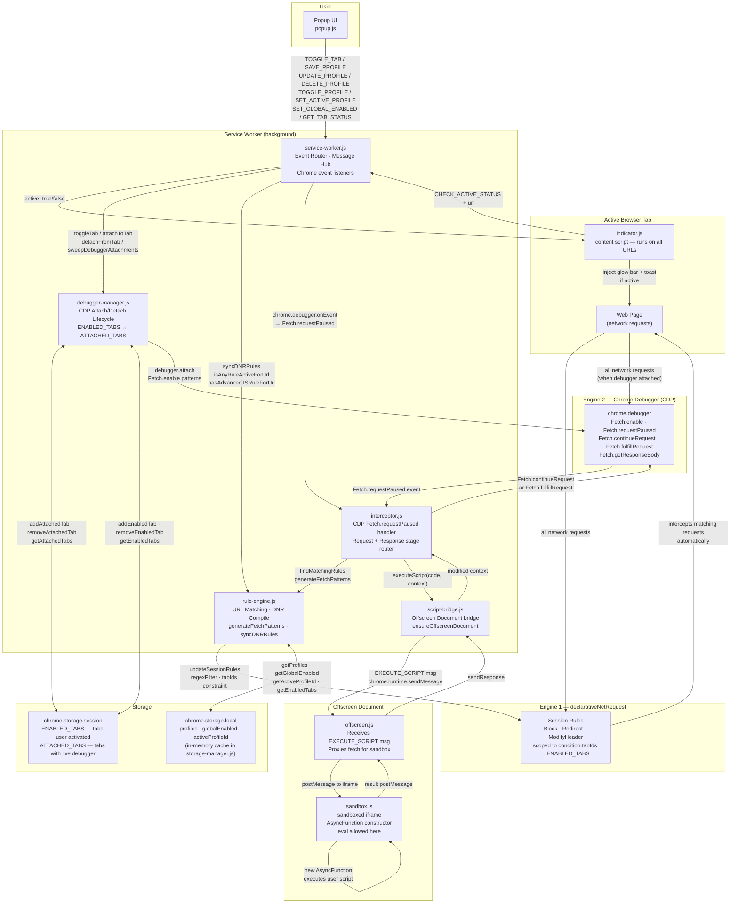

# ModNetwork — Architecture Diagram

> v0.20.x · Two-Engine MV3 Architecture

## Full System Flow



---

## State Gates — What controls when rules fire

| Gate | Storage Key | Set By | Required For |
|---|---|---|---|
| `globalEnabled` | `chrome.storage.local` | Global toggle in popup | Everything — both engines |
| `ENABLED_TABS` | `chrome.storage.session` | User clicks "Attach API" | DNR `tabIds` scope + debugger lifecycle |
| `ATTACHED_TABS` | `chrome.storage.session` | `attachToTab()` | Confirms live CDP session |
| `activeProfileId` | `chrome.storage.local` | User selects profile | Which profile's rules compile |
| Profile `enabled` flag | `chrome.storage.local` | Profile toggle | Whether profile rules compile |

---

## Request Lifecycle

### Engine 1 — Block / Redirect / ModifyHeader

```
User enables tab
  → addEnabledTab(tabId)
  → syncDNRRules()
  → compile session rules with condition.tabIds = [tabId]

Browser makes request
  → Chrome DNR matches rule automatically (no SW involvement)
  → Block / Redirect / ModifyHeader applied transparently
```

### Engine 2 — AdvancedJS Body Modification

```
User enables tab + AdvJS rule matches tab URL
  → attachToTab(tabId)
  → chrome.debugger.attach({ tabId })
  → Fetch.enable({ patterns: [domain-locked patterns] })

Browser makes request
  → Fetch.requestPaused fires in service-worker.js
  → interceptor.js routes to Request or Response stage handler
  → findMatchingRules() finds enabled AdvJS mods matching URL
  → script-bridge.js → offscreen.js → sandbox.js
  → user script runs: AsyncFunction(context, fetch, scriptCode)
  → result returned back through the chain
  → Fetch.continueRequest (modified request headers)
  → Fetch.fulfillRequest (modified response body)
```

---

## Profile Activation Logic (`isProfileActive`)

```
profile.enabled = false  →  inactive (always)
profile.pinned = true    →  always active (if enabled)
activeProfileId set      →  only the matching profile is active
activeProfileId = null   →  first profile in list acts as default
```

---

## Known Issues / Parked Work

| # | Location | Issue | Status |
|---|---|---|---|
| 1 | `service-worker.js:414` | `CHECK_ACTIVE_STATUS` did not check `ENABLED_TABS` → indicator could show on un-enabled tabs if rule is `*://*/*` | **Fixed** |
| 2 | `debugger-manager.js:99` | `isAttached()` returns `isTabEnabled()` not actual `ATTACHED_TABS` state → popup shows "Intercepting" when tab is merely enabled | Open |
| 3 | `dashboard.js` | Entire dashboard uses non-existent message types (`GET_RULES`, `SAVE_RULE`, etc.) — leftover from flat-rules architecture | **Parked — rebuild planned** |
| 4 | `debugger-manager.js:222` | `updateActiveDebuggers()` called `generateFetchPatterns()` without `tabId` — domain-locking lost on rule updates | **Fixed** |
| 5 | `service-worker.js:380` | `DELETE_PROFILE` did not clear stale `activeProfileId` → `isProfileActive` returned false for all profiles after deletion | **Fixed** |
